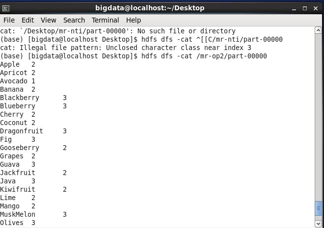

# MapReduce Lab 1 — Word Count (Fruits)

## Task
Count the frequency of each word in a fruits dataset using Hadoop MapReduce streaming with Python.

## Files
| File | Role |
|------|------|
| `mapper.py` | Reads each line, emits `word \t 1` for every word |
| `reducer.py` | Aggregates counts per word, outputs `word \t total` |

## Input Dataset
📄 [`data/fruits.txt`](data/fruits.txt)

## How to Run

```bash
hadoop jar $HADOOP_HOME/share/hadoop/tools/lib/hadoop-streaming-*.jar \
  -input  /input/fruits.txt \
  -output /output/lab1 \
  -mapper mapper.py \
  -reducer reducer.py \
  -file mapper.py \
  -file reducer.py
```

## View Output
```bash
hdfs dfs -cat /output/lab1/part-00000
```

## Output Screenshot

