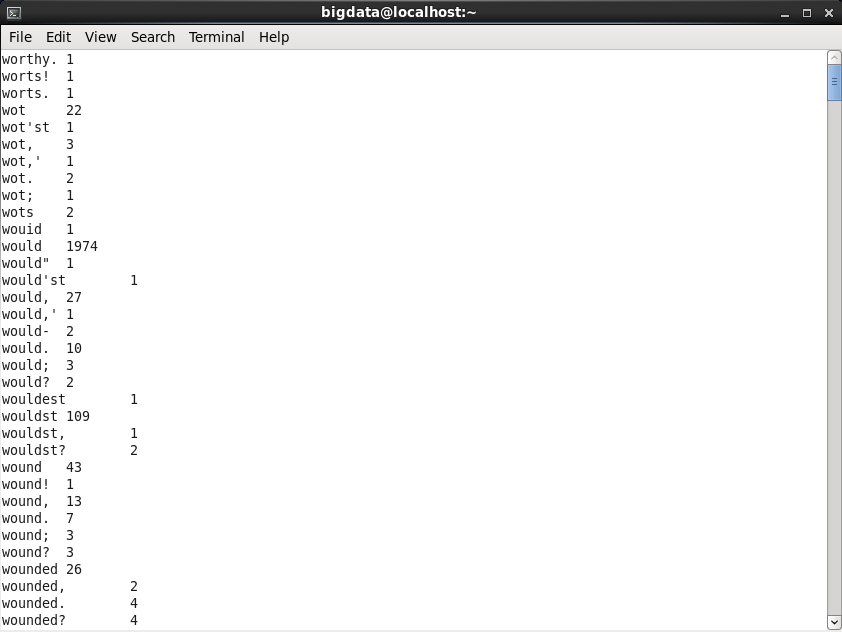

# MapReduce Lab 2 — Word Count (Shakespeare)

## Task
Run word count on a large Shakespeare text corpus to test MapReduce at scale.

## Files
| File | Role |
|------|------|
| `mapper.py` | Emits `word \t 1` for each word in each line |
| `reducer.py` | Aggregates and sorts word counts alphabetically |

## Input Dataset
📄 [`data/shakespeare.txt`](data/shakespeare.txt)

## How to Run

```bash
hadoop jar $HADOOP_HOME/share/hadoop/tools/lib/hadoop-streaming-*.jar \
  -input  /input/shakespeare.txt \
  -output /output/lab2 \
  -mapper mapper.py \
  -reducer reducer.py \
  -file mapper.py \
  -file reducer.py
```

## View Output
```bash
hdfs dfs -cat /output/lab2/part-00000
```

## Output Screenshot

