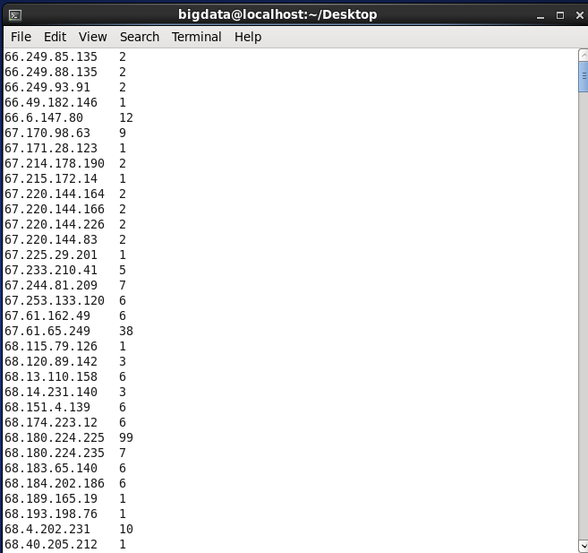

# MapReduce Lab 3 — Apache Log IP Counter

## Task
Parse an Apache web server access log and count the number of HTTP requests per IP address.

## Files
| File | Role |
|------|------|
| `mapper.py` | Extracts the IP address (first field) from each log line, emits `IP \t 1` |
| `reducer.py` | Counts total requests per IP using streaming aggregation |

## Input Dataset
📄 [`data/apachelog.txt`](data/apachelog.txt)

## How to Run

```bash
hadoop jar $HADOOP_HOME/share/hadoop/tools/lib/hadoop-streaming-*.jar \
  -input  /input/apache.log \
  -output /output/lab3 \
  -mapper mapper.py \
  -reducer reducer.py \
  -file mapper.py \
  -file reducer.py
```

## View Output
```bash
hdfs dfs -cat /output/lab3/part-00000
```

## Output Screenshot

```
192.168.1.1    45
192.168.1.2    12
203.0.113.5    88
```
