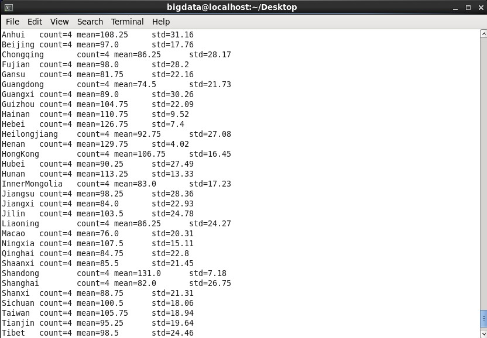

# MapReduce Lab 4 — City Score Statistics (Mean & Std)

## Task
Given a dataset of scores and city names, compute the **mean** and **standard deviation** of scores grouped by city.

## Input Format
Each line is formatted as:
```
score***Region_City
```
Example: `85.5***China_Beijing`

## Files
| File | Role |
|------|------|
| `mapper.py` | Parses each line, extracts city name and score, emits `city \t score` |
| `reducer.py` | Groups scores by city, calculates count, mean, and std deviation |

## Input Dataset
📄 [`data/mr_course_data.txt`](data/mr_course_data.txt)

Format of each line: `score***Region_City***date***id`

Example: `91***CHINA_Beijing***2016-03-23***7001`

## How to Run

```bash
hadoop jar $HADOOP_HOME/share/hadoop/tools/lib/hadoop-streaming-*.jar \
  -input  /input/scores.txt \
  -output /output/lab4 \
  -mapper mapper.py \
  -reducer reducer.py \
  -file mapper.py \
  -file reducer.py
```

## View Output
```bash
hdfs dfs -cat /output/lab4/part-00000
```

## Output Screenshot

```
Beijing    count=120    mean=78.45    std=12.33
Cairo      count=95     mean=82.10    std=9.76
```
